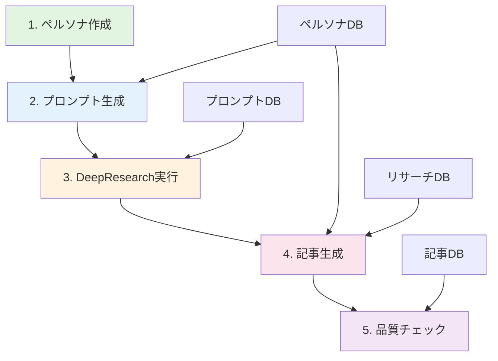

# Design Document

## Overview

AIを活用したAmazonランキング記事量産システムの技術設計。Claude Code CLIベースのツールチェーンとして、ペルソナ作成からDeepResearchプロンプト生成、調査結果管理、記事作成まで一連のワークフローを効率的に実装します。各フェーズのデータは構造化されたマークダウンファイルで管理し、Claude CodeとGemini MCPを効果的に連携させます。

## Steering Document Alignment

### Technical Standards (tech.md)
- CLIベースのアーキテクチャを採用し、UIフレームワークは不要
- マークダウンファイルを標準データフォーマットとして使用
- 各機能を独立したCLIコマンドとして実装
- エラーハンドリングとリカバリー機能を全フェーズに実装

### Project Structure (structure.md)
```
amazon-note-rank/
├── .spec-workflow/           # spec workflow管理
├── projects/                 # プロジェクト管理
│   ├── {project-id}/        # 個別プロジェクト
│   │   ├── persona/         # ペルソナデータ
│   │   ├── prompts/         # DeepResearchプロンプト
│   │   ├── research/        # リサーチ結果
│   │   ├── articles/        # 生成記事
│   │   └── meta/           # プロジェクトメタデータ
├── templates/               # 各種テンプレート
│   ├── persona/            # ペルソナテンプレート
│   ├── prompts/            # プロンプトテンプレート
│   └── article/            # 記事テンプレート
├── scripts/                # CLIスクリプト
└── config/                 # 設定ファイル
```

## Code Reuse Analysis

### Existing Components to Leverage
- **Claude Code CLI**: 既存のCLI機能を活用してペルソナ作成、プロンプト生成、記事作成を実装
- **Gemini MCP**: DeepResearch実行時に条件付きで利用（利用不可時は手動フォールバック）
- **ファイルシステム**: Node.js/Pythonの標準ファイルI/O機能を活用

### Integration Points
- **Claude Code**: 既に認証済みの環境を利用（APIキー管理不要）
- **マークダウンパーサー**: 既存のマークダウン処理ライブラリを活用
- **テンプレートエンジン**: シンプルなテンプレート置換機能を実装

## Architecture

本システムは5つの主要フェーズで構成され、各フェーズは独立したCLIコマンドとして実装されます。データはマークダウンファイルで永続化し、フェーズ間の連携を実現します。

### Modular Design Principles
- **Single File Responsibility**: 各CLIコマンドは単一の責務を持つ
- **Component Isolation**: ペルソナ管理、プロンプト生成、リサーチ管理、記事生成を完全分離
- **Service Layer Separation**: データアクセス、ビジネスロジック、出力生成を分離
- **Utility Modularity**: ファイルI/O、マークダウン処理、テンプレート処理をユーティリティモジュール化



## Components and Interfaces

### Component 1: ペルソナマネージャー
- **Purpose:** ペルソナ情報の作成、保存、管理
- **Interfaces:** 
  - `create-persona`: 新規ペルソナ作成
  - `list-personas`: 既存ペルソナ一覧
  - `load-persona`: ペルソナ読み込み
- **Dependencies:** Claude Code CLI、ファイルシステム
- **Reuses:** マークダウンテンプレート、ファイルI/Oユーティリティ

### Component 2: プロンプトジェネレーター
- **Purpose:** ペルソナ情報を基にDeepResearchプロンプトを生成
- **Interfaces:**
  - `generate-prompts`: プロンプトセット生成
  - `customize-prompt`: プロンプトカスタマイズ
  - `export-prompts`: プロンプトエクスポート
- **Dependencies:** ペルソナマネージャー、Claude Code
- **Reuses:** プロンプトテンプレート、ペルソナデータ

### Component 3: リサーチマネージャー
- **Purpose:** DeepResearch実行と結果管理
- **Interfaces:**
  - `execute-research`: リサーチ実行（Gemini MCP/手動）
  - `import-results`: 手動リサーチ結果インポート
  - `validate-products`: サクラチェッカー確認支援
- **Dependencies:** Gemini MCP（オプショナル）、プロンプトジェネレーター
- **Reuses:** リサーチテンプレート、データ検証ユーティリティ

### Component 4: 記事ジェネレーター
- **Purpose:** リサーチデータを基に記事を生成
- **Interfaces:**
  - `generate-article`: 記事生成
  - `apply-template`: テンプレート適用
  - `insert-affiliate`: アフィリエイトリンク挿入支援
- **Dependencies:** Claude Code、リサーチマネージャー、ペルソナマネージャー
- **Reuses:** 記事テンプレート、マークダウンフォーマッター

### Component 5: 品質チェッカー
- **Purpose:** 生成記事の品質確認と最適化
- **Interfaces:**
  - `check-quality`: 品質チェック実行
  - `suggest-improvements`: 改善提案生成
  - `finalize-article`: 記事最終化
- **Dependencies:** Claude Code、記事ジェネレーター
- **Reuses:** 品質チェックリスト、SEO最適化ルール

## Data Models

### Model 1: ペルソナデータ
```yaml
persona:
  id: "persona-{timestamp}"
  created_at: "2025-09-06T00:00:00Z"
  basic_info:
    age: "25-35"
    gender: "male/female/other"
    occupation: "会社員"
    location: "東京都"
    family: "一人暮らし"
  lifestyle:
    hobbies: ["ゲーム", "料理"]
    weekend: "自宅でリラックス"
    info_source: ["YouTube", "Twitter"]
  purchase_behavior:
    priority: ["価格", "品質", "レビュー"]
    amazon_usage: "月2-3回"
  pain_points:
    - "製品選びに時間をかけたくない"
    - "レビューの信頼性が不安"
```

### Model 2: プロンプトデータ
```yaml
prompts:
  id: "prompt-{timestamp}"
  persona_id: "persona-xxx"
  created_at: "2025-09-06T00:00:00Z"
  keyword_research:
    prompt: "以下のペルソナが検索しそうなAmazon商品キーワードを..."
    context: "{ペルソナ情報}"
  competitor_analysis:
    prompt: "「{キーワード}」で上位表示される競合記事を分析し..."
    focus: ["商品選定基準", "記事構成", "訴求ポイント"]
  product_research:
    prompt: "「{カテゴリ}」の中でレビュー数500以上、評価4.0以上の..."
    criteria: ["サクラチェッカー対象", "中華製品除外"]
```

### Model 3: リサーチ結果データ
```yaml
research:
  id: "research-{timestamp}"
  prompt_id: "prompt-xxx"
  executed_at: "2025-09-06T00:00:00Z"
  method: "gemini_mcp/manual"
  keywords:
    primary: ["ゲーミングモニター", "27インチ"]
    secondary: ["144Hz", "IPS", "応答速度"]
  products:
    - asin: "B0XXX"
      name: "製品名"
      price: 39800
      review_count: 1523
      rating: 4.3
      sakura_check: "合格"
      pros: ["高リフレッシュレート", "色再現性良好"]
      cons: ["スタンドが不安定", "HDR非対応"]
  trends:
    - "USB-C接続需要の増加"
    - "曲面ディスプレイの人気上昇"
```

### Model 4: 記事データ
```yaml
article:
  id: "article-{timestamp}"
  research_id: "research-xxx"
  persona_id: "persona-xxx"
  created_at: "2025-09-06T00:00:00Z"
  meta:
    title: "【2025年版】ゲーミングモニターおすすめランキングTOP10"
    description: "プロゲーマーが選ぶ本当に買うべきゲーミングモニター"
    keywords: ["ゲーミングモニター", "おすすめ", "ランキング"]
  content:
    introduction: "# はじめに\n\n..."
    ranking: "## ランキングTOP10\n\n..."
    conclusion: "## まとめ\n\n..."
  status: "draft/reviewed/published"
  quality_score: 85
```

## Error Handling

### Error Scenarios
1. **Gemini MCP接続失敗**
   - **Handling:** 手動実行モードに自動切り替え、プロンプトと入力フォーマットを表示
   - **User Impact:** 手動でリサーチを実行し、結果を指定フォーマットで入力

2. **ペルソナファイル読み込みエラー**
   - **Handling:** バックアップから復元を試行、失敗時は再作成を提案
   - **User Impact:** エラーメッセージとリカバリー手順を表示

3. **記事生成中断**
   - **Handling:** 部分的な生成結果を保存、再開ポイントを記録
   - **User Impact:** 中断箇所から再開可能、進捗状況を保持

4. **品質チェック基準未達**
   - **Handling:** 具体的な改善点をリスト化、修正提案を生成
   - **User Impact:** 改善ガイドに従って手動修正を実施

5. **ファイル書き込み権限エラー**
   - **Handling:** 権限確認と修正手順を表示、代替保存先を提案
   - **User Impact:** 権限修正または代替パスでの保存

## Testing Strategy

### Unit Testing
- **アプローチ:** 各CLIコマンドの個別機能をテスト
- **重点テスト対象:**
  - ペルソナデータの検証ロジック
  - プロンプト生成アルゴリズム
  - マークダウンパース処理
  - ファイルI/O操作

### Integration Testing
- **アプローチ:** フェーズ間のデータ連携をテスト
- **重点テスト対象:**
  - ペルソナ→プロンプト生成フロー
  - リサーチ結果→記事生成フロー
  - エラー時のフォールバック処理
  - データ整合性チェック

### End-to-End Testing
- **アプローチ:** 完全なワークフローをテスト
- **テストシナリオ:**
  - 新規プロジェクトの完全実行
  - Gemini MCP利用時と手動実行時の両パターン
  - エラー復旧シナリオ
  - 既存データ再利用シナリオ