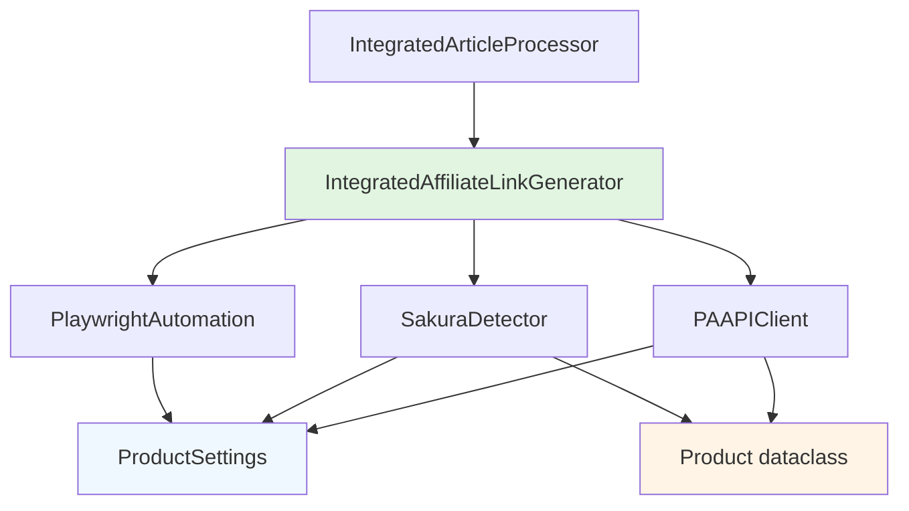

# Design Document

## Overview

PA-API実装とサクラ検出システムは、現在のデモ実装（`EnhancedAmazonSearcher`）を実際のAmazon PA-API 5.0接続に置き換え、Playwrightベースのサクラチェッカー自動化システムを統合する設計です。既存の設定管理、データクラス、記事処理フローを最大限活用し、モジュラー設計により段階的な実装を可能にします。

## Steering Document Alignment

### Technical Standards (tech.md)
現在のプロジェクトはtech.mdが存在しないため、Pythonのベストプラクティスに従います：
- **PEP 8準拠**: コーディングスタイル
- **Type Hints**: 型安全性の確保
- **Dataclasses**: 構造化データの管理
- **uvを使用**: 依存関係管理とパッケージング

### Project Structure (structure.md)
現在のプロジェクト構造に従い、`tools/`ディレクトリ内に新機能を配置：
- `tools/pa_api_client.py`: PA-API接続
- `tools/sakura_detector.py`: サクラ検出システム
- `tools/playwright_automation.py`: ブラウザ自動化

## Code Reuse Analysis

### Existing Components to Leverage
- **ProjectSettings**: 設定管理システムの完全再利用
- **Product dataclass**: 商品データ構造の拡張利用
- **IntegratedAffiliateLinkGenerator**: 品質チェックロジックの統合基盤
- **IntegratedArticleProcessor**: 記事処理フローとの統合

### Integration Points
- **config/settings.yaml**: PA-API認証情報と品質基準設定の追加
- **既存品質チェック**: `_meets_quality_criteria`メソッドの拡張
- **ASIN生成**: `_generate_demo_asin`の実装置換
- **キャッシュシステム**: 既存のデータ保存パターンの活用

## Architecture

### Modular Design Principles
- **Single File Responsibility**: 各ファイルは特定のAPI/機能に専念
- **Component Isolation**: PA-API、サクラ検出、自動化を独立したクラスとして実装
- **Service Layer Separation**: データ取得、分析、出力の明確な分離
- **Utility Modularity**: 共通ユーティリティの再利用可能設計



## Components and Interfaces

### PAAPIClient
- **Purpose:** Amazon PA-API 5.0との通信、実商品データ取得
- **Interfaces:** 
  - `search_products(keyword: str, brand: str = "") -> List[Product]`
  - `get_product_details(asin: str) -> Dict`
  - `batch_lookup(asins: List[str]) -> List[Dict]`
- **Dependencies:** boto3, 設定管理システム
- **Reuses:** ProjectSettingsの設定読み込み、Productデータクラス

### SakuraDetector
- **Purpose:** 統計的異常値検出によるサクラ判定
- **Interfaces:**
  - `analyze_product(product_data: Dict) -> float`
  - `batch_analyze(products: List[Dict]) -> List[float]`
  - `is_suspicious(score: float) -> bool`
- **Dependencies:** numpy/pandas（統計計算）
- **Reuses:** ProjectSettingsの品質基準値

### PlaywrightAutomation
- **Purpose:** サクラチェッカーサイトの自動化
- **Interfaces:**
  - `check_products(asins: List[str]) -> List[Dict]`
  - `batch_check(asins: List[str], batch_size: int = 5) -> List[Dict]`
  - `parse_results(raw_data: str) -> Dict`
- **Dependencies:** playwright
- **Reuses:** ProjectSettingsのタイムアウト設定

### Enhanced IntegratedAffiliateLinkGenerator
- **Purpose:** 既存クラスの拡張、新システム統合
- **Interfaces:** 既存インターフェースを維持、内部実装を強化
- **Dependencies:** PAAPIClient, SakuraDetector, PlaywrightAutomation
- **Reuses:** 既存の記事処理、設定管理、データ構造

## Data Models

### Enhanced Product dataclass
```python
@dataclass
class Product:
    name: str
    model: str
    brand: str
    asin: Optional[str] = None
    amazon_url: Optional[str] = None
    affiliate_url: Optional[str] = None
    # 新規追加フィールド
    price: Optional[int] = None
    rating: Optional[float] = None
    reviews_count: Optional[int] = None
    merchant_id: Optional[str] = None
    sakura_score: Optional[float] = None
    is_quality_approved: bool = False
```

### PAAPIResponse
```python
@dataclass
class PAAPIResponse:
    asin: str
    title: str
    price: Optional[int]
    rating: Optional[float]
    reviews_count: Optional[int]
    merchant_id: Optional[str]
    image_url: Optional[str]
    brand: Optional[str]
```

### SakuraAnalysisResult
```python
@dataclass
class SakuraAnalysisResult:
    asin: str
    sakura_score: float
    suspicion_level: str  # "low", "medium", "high"
    analysis_details: Dict[str, Any]
    checked_at: str
```

## Error Handling

### Error Scenarios
1. **PA-API認証エラー**
   - **Handling:** AuthenticationError例外発生、処理中断
   - **User Impact:** 明確なエラーメッセージでAPI設定確認を促す

2. **PA-APIレート制限**
   - **Handling:** RateLimitError例外発生、処理中断
   - **User Impact:** 制限解除時間の表示

3. **サクラチェッカーサイト接続エラー**
   - **Handling:** NetworkError例外発生、処理中断
   - **User Impact:** サイトアクセス不可の旨表示

4. **Playwright初期化エラー**
   - **Handling:** BrowserError例外発生、処理中断
   - **User Impact:** ブラウザインストール確認を促す

5. **商品検索結果なし**
   - **Handling:** ProductNotFoundError例外発生
   - **User Impact:** 検索キーワードの見直しを提案

## Testing Strategy

### Test-Driven Development (TDD) Principles
**開発方針**: 全実装においてTDD原則を厳格に適用します
- **Red-Green-Refactor サイクル**: 失敗するテスト → 最小実装 → リファクタリング
- **テストファースト**: 実装コードより先にテストコードを作成
- **100%テストカバレッジ**: 全ての関数・クラス・例外処理をテスト
- **モック活用**: 外部依存（PA-API、サクラチェッカー）は全てモック化

### Unit Testing
- **PAAPIClient**: モックを使用したAPI呼び出しテスト
  - TDD: 認証情報読み込みテスト → 実装 → リファクタリング
  - 各例外ケースのテスト → エラーハンドリング実装
- **SakuraDetector**: 既知データセットでの判定精度テスト
  - TDD: 統計分析アルゴリズムテスト → 実装 → 精度向上
- **各例外処理**: エラー条件での適切な例外発生確認
  - TDD: 例外テスト → 例外クラス実装 → エラーメッセージ改善

### Integration Testing
- **設定読み込み**: config/settings.yamlとの統合テスト
- **データフロー**: Product dataclassを通じたデータ変換テスト
- **既存システム**: IntegratedAffiliateLinkGeneratorとの統合テスト

### End-to-End Testing
- **完全ワークフロー**: 商品検索→品質チェック→記事生成の全工程
- **エラー回復**: 各種エラー発生時の適切な処理中断確認
- **パフォーマンス**: 15商品20分処理の達成確認

### TDD Implementation Flow
1. **テスト作成**: 期待動作を定義するテストを作成
2. **テスト実行**: Red（テスト失敗）を確認
3. **最小実装**: テストが通る最小限のコードを実装
4. **テスト実行**: Green（テスト成功）を確認
5. **リファクタリング**: コード品質向上、テストは通したまま
6. **回帰テスト**: 全テストが通ることを確認

## Implementation Strategy

### Phase 1: PA-API基盤実装
1. **PAAPIClient基本実装**
2. **設定ファイル拡張**（PA-API認証情報追加）
3. **既存EnhancedAmazonSearcherの置換**

### Phase 2: サクラ検出システム
1. **SakuraDetector統計分析実装**
2. **品質判定ロジック拡張**
3. **テストデータでの精度検証**

### Phase 3: 自動化システム統合
1. **PlaywrightAutomation実装**
2. **バッチ処理最適化**
3. **全システム統合テスト**

### Dependencies Management (uv)
```toml
[project]
dependencies = [
    "boto3>=1.26.0",
    "playwright>=1.40.0", 
    "pyyaml>=6.0",
    "pandas>=2.0.0",
    "numpy>=1.24.0"
]
```