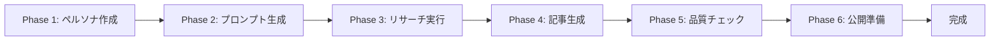

# 統合ワークフローガイド

AIを活用したAmazonランキング記事量産システムの完全実行ガイドです。ペルソナ作成から記事公開まで、各フェーズの詳細手順と品質基準を網羅しています。

---

## 🎯 システム目標

- **収益目標**: 月5万円のアフィリエイト収益
- **生産目標**: 週5本の高品質ランキング記事
- **品質基準**: サクラチェッカー合格製品のみ、レビュー500件以上
- **効率目標**: 1記事あたり20分以内で完成

---

## 📊 ワークフロー全体像



### タイムライン（目安）

| フェーズ | 所要時間 | 成果物 |
|---------|----------|--------|
| Phase 1: ペルソナ作成 | 3分 | ペルソナファイル |
| Phase 2: プロンプト生成 | 2分 | プロンプトセット |
| Phase 3: リサーチ実行 | 5分 | リサーチデータ |
| Phase 4: 記事生成 | 5分 | ドラフト記事 |
| Phase 5: 品質チェック | 3分 | 最適化済み記事 |
| Phase 6: 公開準備 | 2分 | 公開用記事 |
| **合計** | **20分** | **完成記事** |

---

## 🚀 事前準備

### システムセットアップチェックリスト

```bash
# 1. プロジェクト構造の確認
ls -la amazon-note-rank/

# 2. 必要なディレクトリの確認
├── projects/        # プロジェクト管理
├── templates/       # 各種テンプレート
├── prompts/        # プロンプト集
├── checklists/     # チェックリスト
├── guides/         # ガイド文書
├── workflows/      # ワークフロー定義
└── docs/           # ドキュメント
```

### 新規プロジェクトの初期化

```bash
# プロジェクトIDを生成（例: gaming-monitor-2025-09-06）
PROJECT_ID="[カテゴリ]-[日付]"

# プロジェクトディレクトリ作成
mkdir -p projects/$PROJECT_ID/{persona,prompts,research,articles,meta}

# メタデータファイル作成
echo "project_id: $PROJECT_ID" > projects/$PROJECT_ID/meta/project.yaml
echo "created_at: $(date -Iseconds)" >> projects/$PROJECT_ID/meta/project.yaml
echo "status: initialized" >> projects/$PROJECT_ID/meta/project.yaml
```

---

## 📝 Phase 1: ペルソナ作成

### 目的
ターゲット読者の詳細なペルソナを作成し、記事の方向性を確立する。

### 使用ファイル
- **テンプレート**: `templates/persona/basic_template.md`
- **プロンプト**: `prompts/persona_creation.md`
- **チェックリスト**: `checklists/persona_validation.md`

### 実行手順

#### Step 1.1: Claude Codeでペルソナ作成

```bash
claude-code "
@templates/persona/basic_template.md と
@prompts/persona_creation.md を参照して、
[商品カテゴリ]のターゲット読者ペルソナを作成してください。

商品カテゴリ: [例: ゲーミングモニター]
想定読者層: [例: 20-30代の男性ゲーマー]
予算帯: [例: 2-5万円]

保存先: projects/$PROJECT_ID/persona/persona-001.md
"
```

#### Step 1.2: ペルソナ検証

```bash
claude-code "
@projects/$PROJECT_ID/persona/persona-001.md を
@checklists/persona_validation.md の基準でチェックし、
不足があれば追記してください。
"
```

### 成果物と品質基準

**成果物**: `projects/$PROJECT_ID/persona/persona-001.md`

**品質基準**:
- ✅ 基本情報（年齢、性別、職業、居住地）が具体的
- ✅ ライフスタイル情報が3つ以上
- ✅ 購買行動パターンが明確
- ✅ 悩み・課題が3つ以上列挙
- ✅ 情報収集方法が特定されている

---

## 🔍 Phase 2: DeepResearchプロンプト生成

### 目的
ペルソナに基づいて、効果的なリサーチを行うためのプロンプトセットを生成する。

### 使用ファイル
- **テンプレート**: `templates/prompts/research_prompts.md`
- **プロンプト**: `prompts/prompt_generation.md`
- **ペルソナ**: `projects/$PROJECT_ID/persona/persona-001.md`

### 実行手順

#### Step 2.1: プロンプトセット生成

```bash
claude-code "
@prompts/prompt_generation.md を参照し、
@projects/$PROJECT_ID/persona/persona-001.md のペルソナに基づいて、
以下のリサーチプロンプトを生成してください：

1. キーワードリサーチ用プロンプト
2. 競合分析用プロンプト
3. 製品調査用プロンプト
4. トレンド分析用プロンプト

保存先: projects/$PROJECT_ID/prompts/research-prompts.md
"
```

#### Step 2.2: プロンプト最適化

```bash
claude-code "
生成されたプロンプトを確認し、
ペルソナの特性により具体的に合わせて最適化してください。
特に購買決定要因と悩みを反映させてください。
"
```

### 成果物と品質基準

**成果物**: `projects/$PROJECT_ID/prompts/research-prompts.md`

**品質基準**:
- ✅ 4種類のプロンプトが完備
- ✅ ペルソナの悩みが反映されている
- ✅ 具体的な数値基準が含まれている
- ✅ サクラチェッカー確認が明記されている

---

## 🔬 Phase 3: DeepResearch実行

### 目的
プロンプトを使用して包括的なリサーチを実行し、記事の根拠となるデータを収集する。

### 使用ファイル
- **プロンプト**: `projects/$PROJECT_ID/prompts/research-prompts.md`
- **テンプレート**: `templates/research/data_template.md`
- **ガイド**: `guides/research_guide.md`

### 実行手順

#### Step 3.1: Gemini MCPでのリサーチ実行（利用可能な場合）

```bash
claude-code "
@projects/$PROJECT_ID/prompts/research-prompts.md の
各プロンプトをGemini MCPで実行してください。

実行順序：
1. キーワードリサーチ
2. 競合分析
3. 製品調査
4. トレンド分析

結果保存先: projects/$PROJECT_ID/research/
"
```

#### Step 3.2: 手動リサーチ実行（Gemini MCP利用不可の場合）

```bash
# プロンプト表示
claude-code "
@projects/$PROJECT_ID/prompts/research-prompts.md を表示し、
手動実行用の指示を出してください。
"

# 結果入力
claude-code "
@templates/research/data_template.md のフォーマットで
リサーチ結果を入力してください。
保存先: projects/$PROJECT_ID/research/research-data.md
"
```

#### Step 3.3: サクラチェッカー確認

```bash
claude-code "
@projects/$PROJECT_ID/research/research-data.md の
製品リストからサクラチェッカー確認用リストを生成してください。

各製品について：
- ASIN
- 製品名
- サクラチェッカーURL
- 確認結果記入欄

保存先: projects/$PROJECT_ID/research/sakura-check.md
"
```

### 成果物と品質基準

**成果物**: 
- `projects/$PROJECT_ID/research/research-data.md`
- `projects/$PROJECT_ID/research/sakura-check.md`

**品質基準**:
- ✅ 10製品以上の詳細データ
- ✅ 各製品のレビュー数500件以上
- ✅ 評価4.0以上の製品が中心
- ✅ サクラチェッカー確認完了
- ✅ トレンド情報3つ以上

---

## ✍️ Phase 4: 記事生成

### 目的
リサーチデータとペルソナ情報を基に、高品質なランキング記事を生成する。

### 使用ファイル
- **テンプレート**: `templates/article/ranking_article.md`
- **プロンプト**: `prompts/article_generation.md`
- **ペルソナ**: `projects/$PROJECT_ID/persona/persona-001.md`
- **リサーチ**: `projects/$PROJECT_ID/research/research-data.md`

### 実行手順

#### Step 4.1: 記事生成

```bash
claude-code "
@prompts/article_generation.md の指示に従って、
@templates/character/ai_mono_recommender.md のキャラクター設定を厳密に遵守し、
以下のデータを基にランキング記事を生成してください：

キャラクター設定: @templates/character/ai_mono_recommender.md
ペルソナ: @projects/$PROJECT_ID/persona/persona-001.md
リサーチ: @projects/$PROJECT_ID/research/research-data.md
テンプレート: @templates/article/ranking_article.md

重要：AIモノレコメンダーとして客観的・敬語表現で執筆し、
一人称表現や個人的体験談は一切使用しないこと。

記事タイトル: [自動生成または指定]
保存先: projects/$PROJECT_ID/articles/draft-001.md
"
```

#### Step 4.2: アフィリエイトリンクマーカー設置

```bash
claude-code "
生成された記事にアフィリエイトリンクマーカーを設置してください。
各製品の紹介部分とまとめセクションに
<!-- AFFILIATE_LINK_[番号] --> を配置。
"
```

### 成果物と品質基準

**成果物**: `projects/$PROJECT_ID/articles/draft-001.md`

**品質基準**:
- ✅ 3000文字以上
- ✅ ペルソナの悩みへの言及
- ✅ 10製品のランキング掲載
- ✅ 各製品の良い点・悪い点記載
- ✅ 比較表の作成
- ✅ FAQ 5項目以上

---

## ✨ Phase 5: 品質チェック・最適化

### 目的
生成された記事の品質を確認し、SEO最適化と独自性向上を図る。

### 使用ファイル
- **チェックリスト**: `checklists/quality_check.md`
- **SEOガイド**: `checklists/seo_optimization.md`
- **記事**: `projects/$PROJECT_ID/articles/draft-001.md`

### 実行手順

#### Step 5.1: 基本品質チェック

```bash
claude-code "
@projects/$PROJECT_ID/articles/draft-001.md を
@prompts/quality_check.md の基準でチェックし、
特にAIモノレコメンダーのキャラクター設定(@templates/character/ai_mono_recommender.md)
との整合性を重点的に確認して、問題箇所にコメントを付けてください。

チェック項目：
- AIモノレコメンダーキャラクター整合性（重要）
- 誤字脱字
- 論理的整合性
- 情報の正確性
- 読みやすさ
"
```

#### Step 5.2: SEO最適化

```bash
claude-code "
@checklists/seo_optimization.md の基準で
記事をSEO最適化してください：

- タイトル最適化（30-60文字）
- メタディスクリプション作成（120-160文字）
- 見出し構造の調整
- キーワード密度の最適化（1-2%）
- 内部リンクの提案

保存先: projects/$PROJECT_ID/articles/optimized-001.md
"
```

#### Step 5.3: 独自性向上

```bash
claude-code "
記事に独自性を追加してください：

- ペルソナ特有の視点を強化  
- 客観的データに基づく分析コメント追加
- 独自の評価軸の説明強化
- 競合記事との差別化ポイント追加

注意：AIモノレコメンダーのキャラクター設定に従い、
一人称表現や個人的体験談は含めないこと。
"
```

### 成果物と品質基準

**成果物**: `projects/$PROJECT_ID/articles/optimized-001.md`

**品質基準**:
- ✅ 誤字脱字ゼロ
- ✅ SEOスコア80点以上
- ✅ キーワード密度1-2%
- ✅ メタ情報完備
- ✅ 独自視点3つ以上

---

## 🚀 Phase 6: 公開準備

### 目的
記事を公開可能な状態に仕上げ、必要な設定を完了する。

### 実行手順

#### Step 6.1: 最終フォーマット調整

```bash
claude-code "
@projects/$PROJECT_ID/articles/optimized-001.md を
公開用にフォーマット調整してください：

- マークダウン記法の確認
- 画像altタグの設定
- 内部リンクの確認
- アフィリエイトリンクの準備

保存先: projects/$PROJECT_ID/articles/final-001.md
"
```

#### Step 6.2: 公開チェックリスト確認

```bash
claude-code "
最終チェックリストを実行：

□ タイトルとメタ情報の確認
□ 画像の準備状況
□ アフィリエイトリンクの設定
□ カテゴリとタグの設定
□ 公開日時の設定

結果を projects/$PROJECT_ID/meta/publish-checklist.md に保存
"
```

#### Step 6.3: プロジェクト完了処理

```bash
# プロジェクトステータス更新
claude-code "
projects/$PROJECT_ID/meta/project.yaml を更新：
- status: completed
- completed_at: [現在時刻]
- quality_score: [スコア]
- word_count: [文字数]
"
```

### 成果物と品質基準

**成果物**: 
- `projects/$PROJECT_ID/articles/final-001.md`
- `projects/$PROJECT_ID/meta/publish-checklist.md`

**品質基準**:
- ✅ 公開準備完了
- ✅ 全チェック項目クリア
- ✅ アフィリエイト設定完了

---

## 📈 パフォーマンス管理

### KPI追跡

```yaml
weekly_targets:
  articles_count: 5
  total_words: 15000+
  quality_score_avg: 85+
  time_per_article: <20min

monthly_targets:
  articles_count: 20
  revenue_target: 50000円
  conversion_rate: 3%+
```

### 週次レビューテンプレート

```bash
claude-code "
今週のパフォーマンスをレビュー：

1. 作成記事数: [X/5本]
2. 平均作成時間: [XX分]
3. 平均品質スコア: [XX点]
4. 改善点の洗い出し
5. 来週の目標設定

レポート保存先: docs/weekly-reports/week-[N].md
"
```

---

## 🔧 トラブルシューティング

### よくある問題と対処法

#### 1. ペルソナ作成で詰まる場合

```bash
# 競合サイトのターゲット分析から始める
claude-code "
[競合URL]のサイトを分析して、
想定される読者ペルソナを推測してください。
"
```

#### 2. リサーチデータが不足する場合

```bash
# 追加リサーチプロンプトの生成
claude-code "
現在のリサーチデータで不足している情報を特定し、
追加リサーチ用のプロンプトを生成してください。
"
```

#### 3. 記事の独自性が不足する場合

```bash
# ペルソナ深堀りによる差別化
claude-code "
ペルソナの隠れたニーズや、
競合が見落としている視点を3つ提案してください。
"
```

#### 4. SEOスコアが低い場合

```bash
# 競合上位記事の分析
claude-code "
[キーワード]で上位3記事を分析し、
共通する成功要因を抽出してください。
"
```

---

## 🎯 ベストプラクティス

### 効率化のコツ

1. **バッチ処理の活用**
   - 複数記事のペルソナをまとめて作成
   - リサーチを一括実行
   - 類似カテゴリの記事をまとめて作成

2. **テンプレートのカスタマイズ**
   - カテゴリ別のテンプレート作成
   - よく使うプロンプトの保存
   - 成功パターンの文書化

3. **自動化の推進**
   - 定型作業のスクリプト化
   - ワークフローの最適化
   - チェックリストの自動実行

### 品質向上のポイント

1. **ペルソナの深掘り**
   - 実在の人物をイメージ
   - SNSでの生の声を収集
   - 購買後の満足ポイントまで想定

2. **リサーチの徹底**
   - 複数ソースからの情報収集
   - 最新トレンドの反映
   - ネガティブ情報も公平に扱う

3. **記事の差別化**
   - 独自の評価軸の設定
   - 体験談風のエピソード追加
   - ビジュアル要素の活用

---

## 📚 参考リソース

### 内部リソース

- **テンプレート集**: `/templates/`
- **プロンプト集**: `/prompts/`
- **チェックリスト**: `/checklists/`
- **ガイド文書**: `/guides/`
- **ワークフロー**: `/workflows/`

### 活用推奨ツール

- **サクラチェッカー**: https://sakura-checker.jp/
- **キーワードプランナー**: Google Ads
- **競合分析**: Ahrefs, SEMrush（オプション）
- **文章校正**: Claude Code内蔵機能

---

## 🔄 継続的改善

### 月次振り返り項目

1. **生産性分析**
   - 記事作成時間の推移
   - ボトルネックの特定
   - 改善施策の効果測定

2. **品質分析**
   - 読者エンゲージメント
   - 検索順位の推移
   - コンバージョン率

3. **プロセス改善**
   - ワークフローの見直し
   - ツールの最適化
   - テンプレートの更新

### アップデート管理

```bash
# システムアップデート確認
claude-code "
最新のSEOトレンドや、
Amazonアフィリエイトの規約変更を確認し、
必要なシステム更新を提案してください。
"
```

---

## 📋 クイックスタートチェックリスト

新規記事作成時の最小限チェックリスト：

```
□ プロジェクトID決定
□ プロジェクトフォルダ作成
□ ペルソナ作成（3分）
□ プロンプト生成（2分）
□ リサーチ実行（5分）
□ 記事生成（5分）
□ 品質チェック（3分）
□ 公開準備（2分）
□ 完了処理
```

---

このガイドに従って作業を進めることで、週5本の高品質なランキング記事を効率的に作成できます。各フェーズの成果物と品質基準を満たすことで、安定した収益化を実現します。