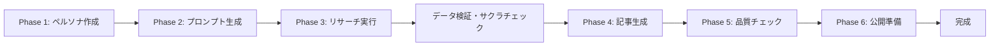

# 統合ワークフローガイド - 完全版

AIを活用したAmazonランキング記事量産システムの統合実行ガイドです。現実的な時間設定で、PA-API実装と手動フォールバック、データ信頼性対策を含む完全なワークフローを提供します。

---

## 🎯 システム目標と現実的な時間設定

### 収益・品質目標
- **収益目標**: 月5万円のアフィリエイト収益
- **生産目標**: 週5本の高品質ランキング記事
- **品質基準**: サクラ度30%以下、レビュー500件以上
- **データ信頼性**: 架空データ完全排除、実データベース記事

### 現実的な時間目標
**従来の目標**: 1記事20分（非現実的）  
**実際の所要時間**: **90-120分/記事**（品質保証含む）

| フェーズ                | 実際の所要時間 | 成果物           |
| ----------------------- | -------------- | ---------------- |
| Phase 1: ペルソナ作成   | 3-5分          | ペルソナファイル |
| Phase 2: プロンプト生成 | 2-3分          | プロンプトセット |
| Phase 3: リサーチ実行   | 30-45分        | リサーチデータ   |
| サクラチェッカー確認    | 45-60分        | 品質検証済み製品 |
| Phase 4: 記事生成       | 10-15分        | ドラフト記事     |
| Phase 5: 品質チェック   | 10-15分        | 最適化済み記事   |
| Phase 6: 公開準備       | 5-10分         | 公開用記事       |
| **合計**                | **90-120分**   | **完成記事**     |

---

## 📊 ワークフロー全体像



---

## 🚀 事前準備とセットアップ

### システムセットアップチェックリスト

```bash
# 1. プロジェクト構造の確認
./amazon-note/

# 2. 必要なディレクトリの確認
├── projects/        # プロジェクト管理
├── templates/       # 各種テンプレート
├── checklists/      # チェックリスト
├── tools/           # 実装ツール（PA-API等）
├── config/          # 設定ファイル
└── docs/            # ドキュメント
```

### 設定ファイル確認
```yaml
# config/settings.yaml の確認
affiliate:
  amazon_associate_id: "your-id-22"
  
product_criteria:
  min_reviews: 500
  min_rating: 4.0
  sakura_threshold: 30

# 環境変数設定（PA-API実装時）
export AWS_ACCESS_KEY_ID="your-access-key"
export AWS_SECRET_ACCESS_KEY="your-secret-key"
```

### 新規プロジェクトの初期化

```bash
# プロジェクトIDを生成（例: gaming-monitor-2025-09-12）
PROJECT_ID="[カテゴリ]-[日付]"

# プロジェクトディレクトリ作成
mkdir -p projects/$PROJECT_ID/{persona,prompts,research,articles,meta}

# メタデータファイル作成
echo "project_id: $PROJECT_ID" > projects/$PROJECT_ID/meta/project.yaml
echo "created_at: $(date -Iseconds)" >> projects/$PROJECT_ID/meta/project.yaml
echo "status: initialized" >> projects/$PROJECT_ID/meta/project.yaml
```

---

## 📝 Phase 1: ペルソナ作成（3-5分）

### 目的
ターゲット読者の詳細なペルソナを作成し、記事の方向性を確立する。

### 使用ファイル
- **テンプレート**: `templates/persona/default_persona.md`
- **プロンプト**: `prompts/persona_creation.md`
- **チェックリスト**: `checklists/persona_validation.md`

### 実行手順

#### Step 1.1: Claude Codeでペルソナ作成

```bash
claude-code "
@templates/persona/default_persona.md と
@prompts/persona_creation.md を参照して、
[商品カテゴリ]のターゲット読者ペルソナを作成してください。

商品カテゴリ: [例: ゲーミングモニター]
想定読者層: [例: 20-30代の男性ゲーマー]
予算帯: [例: 2-5万円]

重要: 「過去の自分」をペルソナにする手法を活用してください。

保存先: projects/$PROJECT_ID/persona/persona-001.md
"
```

#### Step 1.2: ペルソナ検証

```bash
claude-code "
@projects/$PROJECT_ID/persona/persona-001.md を
@checklists/persona_validation.md の基準でチェックし、
不足があれば追記してください。
"
```

### 成果物と品質基準

**成果物**: `projects/$PROJECT_ID/persona/persona-001.md`

**品質基準**:
- ✅ 基本情報（年齢、性別、職業、居住地）が具体的
- ✅ ライフスタイル情報が3つ以上
- ✅ 購買行動パターンが明確
- ✅ 悩み・課題が3つ以上列挙
- ✅ 情報収集方法が特定されている

---

## 🔍 Phase 2: DeepResearchプロンプト生成（2-3分）

### 目的
ペルソナに基づいて、効果的なリサーチを行うためのプロンプトセットを生成する。

### 使用ファイル
- **テンプレート**: `templates/prompts/research_prompts.md`
- **プロンプト**: `prompts/prompt_generation.md`
- **ペルソナ**: `projects/$PROJECT_ID/persona/persona-001.md`

### 実行手順

#### Step 2.1: プロンプトセット生成

```bash
claude-code "
@prompts/prompt_generation.md を参照し、
@projects/$PROJECT_ID/persona/persona-001.md のペルソナに基づいて、
以下のリサーチプロンプトを生成してください：

1. キーワードリサーチ用プロンプト
2. 競合分析用プロンプト
3. 製品調査用プロンプト
4. トレンド分析用プロンプト

重要改善点:
- データ検証要求を明示化
- 架空情報の禁止を明記
- ソース確認の義務化

保存先: projects/$PROJECT_ID/prompts/research-prompts.md
"
```

### 成果物と品質基準

**成果物**: `projects/$PROJECT_ID/prompts/research-prompts.md`

**品質基準**:
- ✅ 4種類のプロンプトが完備
- ✅ ペルソナの悩みが反映されている
- ✅ 具体的な数値基準が含まれている
- ✅ データ検証要求が明記されている

---

## 🔬 Phase 3: DeepResearch実行（30-45分）

### 実装方式による分岐

#### パターンA: PA-API実装版（3-5分 - 未来の目標）

```bash
# 完全自動化：PA-API → サクラ検出 → Playwright確認
python3 tools/affiliate_link_generator_integrated.py --project-id "$PROJECT_ID"
```

**自動処理内容**:
1. **PA-API商品検索**（30秒）
2. **サクラ検出分析**（1-2分）
3. **Playwright自動サクラチェッカー**（2分）

#### パターンB: 手動実行版（現実的アプローチ）

##### Step 3.1: リサーチ手法の選択

**Gemini MCP利用可能な場合**:
```bash
# 生成されたプロンプトを順次実行
mcp__gemini-cli__ask-gemini --prompt "[キーワードリサーチプロンプト]"
```

**Gemini MCP利用不可の場合**:
1. 生成されたプロンプトをコピー
2. Gemini/ChatGPTなどで手動実行
3. 結果を手動でコピー&収集

##### Step 3.2: データ検証の義務化（重要改善）

**データ信頼性チェック**:
- すべての統計データに明確なソースを要求
- 架空情報の禁止（人物名、企業名、具体的エピソード）
- 商品仕様の複数ソース確認
- 在庫・価格の実時間確認

##### Step 3.3: サクラチェッカー確認（45-60分）

```bash
claude-code "
@projects/$PROJECT_ID/research/research-data.md の
製品リストからサクラチェッカー確認用リストを生成してください。

各製品について：
- ASIN
- 製品名
- サクラチェッカーURL
- 確認結果記入欄

保存先: projects/$PROJECT_ID/research/sakura-check.md
"
```

**手動サクラチェッカー確認プロセス**:
1. 各商品のASINを手動でサクラチェッカーサイトに入力
2. 結果を目視確認
3. 15商品で約60分（実測値）
4. サクラ度30%以下のみ採用

### 成果物と品質基準

**成果物**: 
- `projects/$PROJECT_ID/research/research-data.md`
- `projects/$PROJECT_ID/research/sakura-check.md`

**品質基準**:
- ✅ 6-10製品以上の詳細データ（サクラ度30%以下）
- ✅ 各製品のレビュー数500件以上
- ✅ 評価4.0以上の製品が中心
- ✅ すべての情報にソースが明記
- ✅ 架空データの完全排除

---

## ✍️ Phase 4: 記事生成（10-15分）

### 目的
リサーチデータとペルソナ情報を基に、高品質なランキング記事を生成する。

### 使用ファイル
- **テンプレート**: `templates/article/ai_analysis_ranking.md`
- **プロンプト**: `prompts/article_generation.md`
- **ペルソナ**: `projects/$PROJECT_ID/persona/persona-001.md`
- **リサーチ**: `projects/$PROJECT_ID/research/research-data.md`

### テンプレート選択ガイド

| テンプレート             | 適用ケース     | 特徴                    |
| ------------------------ | -------------- | ----------------------- |
| `ai_analysis_ranking.md` | データ志向読者 | 客観的分析、2000-3000語 |

### 実行手順

#### Step 4.1: 記事生成

```bash
claude-code "
@prompts/article_generation.md の指示に従って、
@templates/character/ai_mono_recommender.md のキャラクター設定を厳密に遵守し、
以下のデータを基にランキング記事を生成してください：

キャラクター設定: @templates/character/ai_mono_recommender.md
ペルソナ: @projects/$PROJECT_ID/persona/persona-001.md
リサーチ: @projects/$PROJECT_ID/research/research-data.md
テンプレート: [選択したテンプレート]

重要改善点:
- リアルタイム事実確認：調査レポートとの段落単位での整合性確認
- 読者視点言語変換：専門用語の即座な言い換え
- 不要情報の除去：セール情報、メタ情報の自動除外
- 実データのみ使用：架空データは一切使用しない

記事タイトル: [自動生成]
保存先: projects/$PROJECT_ID/articles/draft-001.md
"
```

#### Step 4.2: アフィリエイトリンクマーカー設置

```bash
claude-code "
生成された記事にアフィリエイトリンクマーカーを設置してください。
各製品の紹介部分とまとめセクションに
<!-- AFFILIATE_LINK_[番号] --> を配置。
"
```

### 成果物と品質基準

**成果物**: `projects/$PROJECT_ID/articles/draft-001.md`

**品質基準**:
- ✅ 2000文字以上（テンプレートに応じて調整）
- ✅ ペルソナの悩みへの言及
- ✅ 6-10製品のランキング掲載
- ✅ 実データに基づく客観的評価
- ✅ 各製品の良い点・悪い点記載
- ✅ 比較表の作成
- ✅ FAQ 5項目以上

---

## ✨ Phase 5: 品質チェック・最適化（10-15分）

### 目的
生成された記事の品質を確認し、SEO最適化と独自性向上を図る。

### 使用ファイル
- **チェックリスト**: `checklists/quality_check.md`
- **SEOガイド**: `checklists/seo_optimization.md`
- **記事**: `projects/$PROJECT_ID/articles/draft-001.md`

### 実行手順

#### Step 5.1: データ信頼性チェック（重要改善）

```bash
claude-code "
@projects/$PROJECT_ID/articles/draft-001.md を
以下の新しい品質基準でチェックしてください：

データ信頼性チェック（重要）:
- 架空データの完全排除確認
- 統計データのソース確認
- 商品仕様の正確性検証
- 価格・在庫情報の最新性確認

従来の品質チェック:
- AIモノレコメンダーキャラクター整合性
- 誤字脱字
- 論理的整合性
- 読みやすさ
"
```

#### Step 5.2: SEO最適化

```bash
claude-code "
@checklists/seo_optimization.md の基準で
記事をSEO最適化してください：

- タイトル最適化（30-60文字）
- メタディスクリプション作成（120-160文字）
- 見出し構造の調整
- キーワード密度の最適化（1-2%）
- 内部リンクの提案

保存先: projects/$PROJECT_ID/articles/optimized-001.md
"
```

#### Step 5.3: 読者理解性テスト（改善項目）

```bash
claude-code "
記事の読者理解性を向上させてください：

- 専門用語の自動言い換え
- 一般読者視点での内容確認
- 具体的なベネフィット表現への変換
- 不要な情報の除去
"
```

### 成果物と品質基準

**成果物**: `projects/$PROJECT_ID/articles/optimized-001.md`

**新しい品質基準**:
- ✅ データ信頼性: 100%（架空データの完全排除）
- ✅ 読者理解性: 専門用語の適切な変換
- ✅ 商品妥当性: 在庫・価格情報の確認
- ✅ 誤字脱字ゼロ
- ✅ SEOスコア80点以上
- ✅ 独自視点3つ以上

---

## 🚀 Phase 6: 公開準備（5-10分）

### 目的
記事を公開可能な状態に仕上げ、必要な設定を完了する。

### 実行手順

#### Step 6.1: 最終フォーマット調整

```bash
claude-code "
@projects/$PROJECT_ID/articles/optimized-001.md を
公開用にフォーマット調整してください：

- マークダウン記法の確認
- 画像altタグの設定
- 内部リンクの確認
- アフィリエイトリンクの準備

保存先: projects/$PROJECT_ID/articles/final-001.md
"
```

#### Step 6.2: 公開チェックリスト確認

```bash
claude-code "
最終チェックリストを実行：

□ タイトルとメタ情報の確認
□ 画像の準備状況
□ アフィリエイトリンクの設定
□ カテゴリとタグの設定
□ 公開日時の設定
□ データ信頼性の最終確認

結果を projects/$PROJECT_ID/meta/publish-checklist.md に保存
"
```

#### Step 6.3: プロジェクト完了処理

```bash
# プロジェクトステータス更新
claude-code "
projects/$PROJECT_ID/meta/project.yaml を更新：
- status: completed
- completed_at: [現在時刻]
- quality_score: [スコア]
- word_count: [文字数]
- data_reliability: verified
"
```

### 成果物と品質基準

**成果物**: 
- `projects/$PROJECT_ID/articles/final-001.md`
- `projects/$PROJECT_ID/meta/publish-checklist.md`

**品質基準**:
- ✅ 公開準備完了
- ✅ 全チェック項目クリア
- ✅ アフィリエイト設定完了
- ✅ データ信頼性検証完了

---

## ⚠️ エラー対応とトラブルシューティング

### データ信頼性問題発生時
1. **即座の記事公開停止**
2. **問題箇所の特定と修正**
3. **類似問題の全記事横断確認**
4. **再発防止策の実装**

### 品質問題の段階別対応
- **軽微（専門用語等）**: 即座の修正と継続
- **中程度（仕様誤り等）**: 確認後の修正と検証強化
- **重大（架空データ等）**: 全面見直しと工程改善

### PA-API実装時のエラー対応

#### 認証エラー
```bash
# 環境変数確認
echo $AWS_ACCESS_KEY_ID
echo $AWS_SECRET_ACCESS_KEY

# 設定ファイル確認
cat config/settings.yaml | grep associate_tag
```

#### レート制限エラー
- システムは自動リトライを実装済み
- 指数バックオフによる適応的な待機

---

## 📈 パフォーマンス管理

### KPI追跡（改善版）

```yaml
weekly_targets:
  articles_count: 5
  total_words: 15000+
  quality_score_avg: 85+
  time_per_article: 90-120min  # 現実的な設定
  data_reliability: 100%       # 新設

monthly_targets:
  articles_count: 20
  revenue_target: 50000円
  conversion_rate: 3%+
  data_accuracy_rate: 100%     # 新設
```

### 週次レビューテンプレート

```bash
claude-code "
今週のパフォーマンスをレビュー：

1. 作成記事数: [X/5本]
2. 平均作成時間: [XX分] (目標: 90-120分)
3. 平均品質スコア: [XX点]
4. データ信頼性: [XX%] (目標: 100%)
5. 改善点の洗い出し
6. 来週の目標設定

レポート保存先: docs/weekly-reports/week-[N].md
"
```

---

## 🎯 ベストプラクティス

### 効率化のコツ

1. **バッチ処理の活用**
   - 複数記事のペルソナをまとめて作成
   - リサーチを一括実行
   - 類似カテゴリの記事をまとめて作成

2. **テンプレートのカスタマイズ**
   - カテゴリ別のテンプレート作成
   - よく使うプロンプトの保存
   - 成功パターンの文書化

3. **品質保証の自動化**
   - データ検証の即時警告システム
   - 架空情報の完全排除
   - 商品情報の複数ソース確認

### 継続的改善

#### 月次振り返り項目
1. **生産性分析**
   - 記事作成時間の推移
   - ボトルネックの特定
   - 改善施策の効果測定

2. **品質分析**
   - データ信頼性の維持
   - 読者エンゲージメント
   - 検索順位の推移
   - コンバージョン率

3. **プロセス改善**
   - ワークフローの見直し
   - ツールの最適化
   - テンプレートの更新

---

## 📚 参考リソース

### 内部リソース
- **テンプレート集**: `/templates/`
- **プロンプト集**: `/prompts/`
- **チェックリスト**: `/checklists/`
- **実装ツール**: `/tools/`
- **設定ファイル**: `config/settings.yaml`

### 活用推奨ツール
- **サクラチェッカー**: https://sakura-checker.jp/
- **Amazon PA-API**: 商品データ取得（実装時）
- **文章校正**: Claude Code内蔵機能

---

## 📋 クイックスタートチェックリスト

新規記事作成時の確認項目：

```
□ プロジェクトID決定
□ プロジェクトフォルダ作成
□ ペルソナ作成（3-5分）
□ プロンプト生成（2-3分）
□ リサーチ実行（30-45分）
□ サクラチェッカー確認（45-60分）
□ 記事生成（10-15分）
□ データ信頼性チェック（必須）
□ 品質チェック（10-15分）
□ 公開準備（5-10分）
□ 完了処理
```

**目標時間**: 90-120分  
**品質基準**: レビュー数500件以上、サクラ度30%以下、データ信頼性100%

---

このワークフローにより、データの信頼性を保ちながら、現実的な時間で高品質なランキング記事を継続的に作成することができます。段階的な改善により、将来的にはPA-API実装による自動化も可能です。